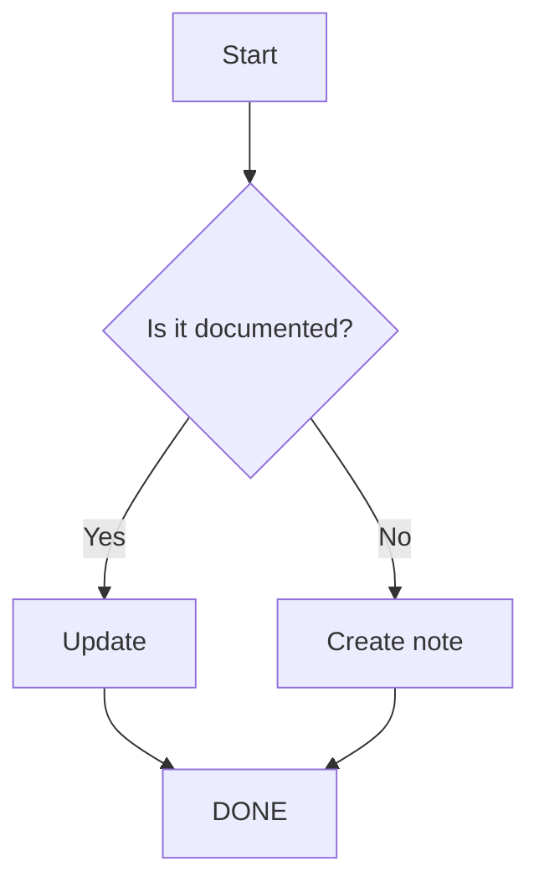
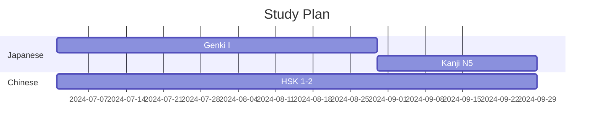

# Инструменты — Микро-детали

## 1. Git workflow — продвинутые сценарии

### 1.1 Работа с ветками

```bash
# Создать ветку для новой темы
git checkout -b feature/add-hindi-language

# Вернуться к main
git checkout main

# Слить ветку
git merge feature/add-hindi-language

# Удалить ветку
git branch -d feature/add-hindi-language
```

### 1.2 Конфликты — разрешение

```bash
# Возник конфликт при merge
git merge feature/new-structure
# CONFLICT in knowledge/index.md

# Посмотреть конфликтующие файлы
git status

# Открыть файл, найти маркеры:
# <<<<<<< HEAD
# текущая версия
# =======
# вливаемое изменение
# >>>>>>> feature/new-structure

# После исправления:
git add knowledge/index.md
git commit
```

### 1.3 Cherry-pick — взять только нужный коммит

```bash
# Взять один коммит из другой ветки
git cherry-pick abc123def

# Взять несколько (не последовательные)
git cherry-pick abc123 def456 ghi789
```

### 1.4 Rebase — перебазирование

```bash
# Перебазировать текущую ветку на main
git rebase main

# Интерактивный rebase — переписать историю
git rebase -i HEAD~5

# Доступные операции:
# pick — оставить
# reword — изменить сообщение
# edit — остановиться для изменений
# squash — объединить с предыдущим
# fixup — объединить, отбросив сообщение
# drop — удалить коммит
```

### 1.5 Git hooks — автоматизация

```bash
# .git/hooks/post-commit
#!/bin/bash
# Автоматический push после commit
git push origin main
```

```bash
# .git/hooks/pre-commit
#!/bin/bash
# Проверка: нет ли в файлах TODO
if grep -r "TODO" knowledge/ --include="*.md"; then
    echo "⚠️  Внимание: найдены TODO в файлах!"
    exit 1
fi
```

---

## 2. VSCode — продвинутые workflow

### 2.1 Snippets для быстрого ввода

```json
// .vscode/knowledge.code-snippets
{
    "Book note": {
        "prefix": "booknote",
        "body": [
            "---",
            "title: \"$1\"",
            "author: \"$2\"",
            "rating: ",
            "status: to-read",
            "---",
            "",
            "## Summary",
            "",
            "## Key Ideas",
            "",
            "## Quotes",
            ""
        ],
        "description": "Book note template"
    },
    "Language word": {
        "prefix": "langword",
        "body": [
            "### $1",
            "",
            "**Язык:** $2",
            "**Слово:** $3",
            "**Чтение:** $4",
            "**Перевод:** $5",
            "**Пример:** $6",
            ""
        ],
        "description": "Language word entry"
    }
}
```

### 2.2 Tasks — автоматические команды

```json
// .vscode/tasks.json
{
    "version": "2.0.0",
    "tasks": [
        {
            "label": "Git: commit & push",
            "type": "shell",
            "command": "git add -A && git commit -m 'update: ${input:message}' && git push",
            "problemMatcher": [],
            "group": "none"
        },
        {
            "label": "Git: status",
            "type": "shell",
            "command": "git status --short",
            "group": "none"
        },
        {
            "label": "Stats: word count",
            "type": "shell",
            "command": "find knowledge -name '*.md' -exec wc -w {} + | tail -1",
            "group": "none"
        }
    ]
}
```

### 2.3 Keybindings

```json
// keybindings.json (Preferences: Open Keyboard Shortcuts)
[
    {
        "key": "ctrl+alt+b",
        "command": "markdown-preview-enhanced.openPreview"
    },
    {
        "key": "ctrl+alt+g",
        "command": "workbench.view.scm"
    },
    {
        "key": "ctrl+shift+f",
        "command": "workbench.action.findInFiles",
        "when": "!searchViewletVisible"
    }
]
```

---

## 3. Markdown — продвинутый синтаксис

### 3.1 Mermaid — диаграммы (Obsidian/GitHub)





### 3.2 LaTeX — математика

```latex
// Inline: $E = mc^2$
// Block:

$$
\int_{a}^{b} f(x) \, dx = F(b) - F(a)
$$

$$
\sum_{n=1}^{\infty} \frac{1}{n^2} = \frac{\pi^2}{6}
$$

$$
\begin{pmatrix}
a & b \\
c & d
\end{pmatrix}
$$
```

### 3.3 Callouts (Obsidian)

```markdown
> [!NOTE] Это заметка
> Полезная информация

> [!WARNING] Внимание
> Это важно!

> [!TIP] Совет
> Так будет лучше

> [!DANGER] Опасно
> Это может вызвать ошибку

> [!EXAMPLE] Пример
> Вот как это работает
```

---

## 4. GitHub Actions — автоматизация базы

### 4.1 Автоматическая проверка ссылок

```yaml
# .github/workflows/check-links.yml
name: Check Links
on:
  schedule:
    - cron: '0 6 * * 1'  # Каждый понедельник
  workflow_dispatch:

jobs:
  check:
    runs-on: ubuntu-latest
    steps:
      - uses: actions/checkout@v4
      - name: Check Markdown links
        uses: gaurav-nelson/github-action-markdown-link-check@v1
        with:
          use-quiet-mode: 'yes'
```

### 4.2 Автоформатирование

```yaml
# .github/workflows/format.yml
name: Format
on:
  push:
    branches: [main]
  
jobs:
  format:
    runs-on: ubuntu-latest
    steps:
      - uses: actions/checkout@v4
      - name: Prettify markdown
        uses: creyD/prettier_action@v4.3
        with:
          prettier_options: '--write **/*.md'
```

### 4.3 Статистика репозитория

```yaml
# .github/workflows/stats.yml
name: Stats
on:
  schedule:
    - cron: '0 0 * * 0'  # Каждое воскресенье
  
jobs:
  stats:
    runs-on: ubuntu-latest
    steps:
      - uses: actions/checkout@v4
      - name: Generate stats
        run: |
          echo "# Статистика базы знаний" > stats.md
          echo "" >> stats.md
          echo "## Количество файлов" >> stats.md
          find knowledge -name "*.md" | wc -l >> stats.md
          echo "## Общий объём (слов)" >> stats.md
          find knowledge -name "*.md" -exec cat {} + | wc -w >> stats.md
          echo "## Распределение по категориям" >> stats.md
          for dir in knowledge/*/; do
            name=$(basename "$dir")
            count=$(find "$dir" -name "*.md" | wc -l)
            words=$(find "$dir" -name "*.md" -exec cat {} + | wc -w)
            echo "- $name: $count файлов, $words слов" >> stats.md
          done
```

---

## 5. Obsidian — продвинутые плагины

### 5.1 Dataview — примеры запросов

```dataview
# Все книги по философии
TABLE author, rating, status
FROM "knowledge"
WHERE contains(file.tags, "philosophy")
SORT rating DESC

# Случайная заметка для повторения
TABLE file.day, file.tags
FROM "knowledge"
SORT random() ASC
LIMIT 1

# Количество заметок по тегам
TABLE length(rows) AS count
FROM "knowledge"
FLATTEN file.tags AS tag
GROUP BY tag
SORT count DESC
```

### 5.2 Templater — сценарии

```javascript
// Вставка даты
<% tp.date.now("YYYY-MM-DD dddd") %>

// Создание заметки по шаблону
<% tp.file.include("templates/book-note") %>

// Запрос пользователя
<% tp.system.prompt("Book title") %>

// Выбор из списка
<% tp.system.suggester(["Read", "Reading", "To Read"], ["read", "reading", "to-read"]) %>

// Вставка содержимого файла
<% tp.file.content("knowledge/index.md") %>
```

### 5.3 Periodic Notes — настройка

```
Ежедневные заметки: knowledge/daily/YYYY/MM/YYYY-MM-DD.md
Еженедельные: knowledge/weekly/YYYY/YYYY-WW.md
Ежемесячные: knowledge/monthly/YYYY-MM.md
```

---

## 6. Автоматизация — скрипты

### 6.1 sync.sh — полный sync

```bash
#!/bin/bash
# sync.sh — push базы знаний

cd "$(dirname "$0")"

# Проверить изменения
if git diff --quiet && git diff --cached --quiet; then
    echo "✅  Нет изменений"
    exit 0
fi

# Показать что изменилось
echo "📝  Изменения:"
git status --short

# Добавить, закоммитить, запушить
git add -A
git commit -m "sync: $(date +%Y-%m-%dT%H:%M:%S)"
git push

echo "✅  Синхронизировано"
```

### 6.2 check-structure.sh — проверка структуры

```bash
#!/bin/bash
# check-structure.sh — проверка целостности

errors=0

# 1. index.md должен быть в каждой папке
for dir in knowledge/*/; do
    if [ ! -f "${dir}/index.md" ]; then
        echo "❌  Нет index.md в $dir"
        errors=$((errors + 1))
    fi
done

# 2. Нет файлов без расширения
for file in knowledge/**/*; do
    if [ ! -d "$file" ] && [ "${file##*.}" != "md" ]; then
        echo "❌  Не .md файл: $file"
        errors=$((errors + 1))
    fi
done

if [ $errors -eq 0 ]; then
    echo "✅  Структура в порядке"
else
    echo "⚠️  $errors ошибок"
fi
```

### 6.3 stats.sh — статистика

```bash
#!/bin/bash

echo "═══════════════════════════════"
echo "  База знаний — Статистика"
echo "═══════════════════════════════"
echo ""

total_files=$(find knowledge -name "*.md" | wc -l)
total_words=$(find knowledge -name "*.md" -exec cat {} + | wc -w)
total_lines=$(find knowledge -name "*.md" -exec cat {} + | wc -l)
last_modified=$(find knowledge -name "*.md" -exec stat -c "%Y" {} + | sort -n | tail -1 | xargs -I{} date -d @{} "+%Y-%m-%d %H:%M")

echo "📁  Файлов:       $total_files"
echo "📝  Слов:         $total_words"
echo "📏  Строк:        $total_lines"
echo "🕐  Последнее изменение: $last_modified"
echo ""

echo "По категориям:"
for dir in knowledge/*/; do
    name=$(basename "$dir")
    files=$(find "$dir" -name "*.md" | wc -l)
    words=$(find "$dir" -name "*.md" -exec cat {} + | wc -w)
    printf "  %-20s %3d файлов, %6d слов\n" "$name" "$files" "$words"
done

echo ""
echo "По подкатегориям:"
for dir in knowledge/*/*/; do
    name=$(basename "$dir")
    parent=$(basename "$(dirname "$dir")")
    files=$(find "$dir" -name "*.md" | wc -l)
    if [ "$files" -gt 0 ]; then
        printf "  %-20s %3d файлов\n" "$parent/$name" "$files"
    fi
done
```

---

## 7. Работа на нескольких устройствах

### 7.1 Obsidian Sync (платный) vs Git

| Критерий | Obsidian Sync | Git |
|----------|--------------|-----|
| Цена | $5/мес | Бесплатно |
| Конфликты | Авто | Ручное разрешение |
| История | 30 дней | Вся история |
| Версионирование | Нет | Да |
| Коллаборация | Нет | Да |
| Шифрование | E2E | SSH/GPG |

### 7.2 Настройка multi-device через Git

```bash
# Компьютер 1 (основной)
git clone git@github.com:madsaomi13/materials.git
# работа...

# Компьютер 2
git clone git@github.com:madsaomi13/materials.git

# Важно: pull перед работой!
# На устройстве 2:
git pull --rebase
# Работа, commit, push

# На устройстве 1:
git pull --rebase
```

### 7.3 Mobile

**iOS:**
- Obsidian Mobile — редактор
- Working Copy — Git клиент
- Shortcuts — автоматизация

**Android:**
- Obsidian Mobile — редактор
- Termux — Git
- MGit — Git GUI

---

## 8. Миграция между платформами

### 8.1 Obsidian → другие

```markdown
# Obsidian to Notion
# Экспорт в Markdown → импорт через Notion API

# Obsidian to Roam Research
# JSON export через плагин

# Obsidian to Logseq
# Просто открыть ту же папку (Logseq читает Markdown)
```

### 8.2 Формат — почему Markdown

- Самый портативный формат
- Читается любым редактором
- Git-friendly (diff, merge)
- Obsidian, Logseq, Notion, Roam — все импортят .md

---

## 9. Матрица выбора инструмента

Какую задачу решить — и каким инструментом. Колонка «НЕ применять» важна, чтобы не тащить молоток туда, где нужна отвёртка.

| Задача | Инструмент | Когда НЕ применять |
|--------|-----------|-------------------|
| Синхронизация заметок | Git + Obsidian Git | Не для двоих активных авторов в реальном времени — нужен Obsidian Sync |
| Быстрые правки заметок | VSCode | Одну заметку — не VS Code, хватит Obsidian |
| Скрипт разовой чистки | bash | Задача на десятки шагов с проверками → Python |
| Деплой статической базы | GitHub Pages | Если нужна база данных / авторизация → VPS или Netlify |
| Управление зависимостями Python | Poetry | Простой скрипт без ВЗ → venv + requirements.txt |
| Среда проекта из нескольких сервисов | Docker Compose | Один сервис → `docker run` без compose |
| Оркестровка CI | GitHub Actions | Частные репо GitLab → GitLab CI |
| Учёт задач | Obsidian Kanban | Длинный спринт с эстимейтами → полноценный трекер (Jira / Linear) |
| Пароли | Менеджер паролей (KeePass/Bitwarden) | Пароль один и никому не нужен → мастер-пароль ОС |
| Много устройств + плагины | Obsidian | Дёшево и просто → любая текстовка и git |
| Хранение тяжёлых файлов | Git LFS / облако | Маленькие тексты → обычный git |

---

## 10. Шпаргалка: Git — полный набор команд

### 10.1 Настройка и состояние

```bash
git config --global user.name "Имя"
git config --global user.email "mail@example.com"
git config --global core.editor "code --wait"   # внешний редактор
git config --global init.defaultBranch main
git config --global pull.rebase true
git config --global alias.co checkout           # алиасы
git config --global alias.br branch
git config --global alias.st status
git config --global alias.lg "log --oneline --graph --all"
git status                    # рабочее дерево
git status --short            # компактно
git diff                      # незакоммиченные изменения
git diff --staged             # только staged
git show <commit>             # содержимое коммита
```

### 10.2 Ежедневный поток

```bash
git clone <url>
git add <file> | git add -A
git commit -m "сообщение"
git push origin <branch>
git pull                       # pull = fetch + merge
git pull --rebase              # стянуть и перебазировать
git fetch origin               # просто обновить refs, без merge
git switch <branch>            # новый способ (вместо checkout)
git switch -c feature/x        # создать + перейти
```

### 10.3 История

```bash
git log --oneline
git log --oneline --graph --all
git log --author="name" --oneline
git log -5 --oneline           # последние 5
git log -p -- <file>           # история файла с диффами
git log --since="2 weeks ago"
git blame <file>               # кто и когда менял строку
git reflog                     # журнал всех операций (спасает после reset)
```

### 10.4 Undo / отмена (аккуратно!)

```bash
git restore <file>             # отменить незакоммиченные изменения файла
git restore --staged <file>    # убрать из staging (не трогает файл)
git checkout -- <file>         # старый способ отмены
git reset HEAD~1               # убрать последний коммит, изменения остаются
git reset --hard HEAD~1        # убрать коммит И изменения ⚠️
git reset --soft HEAD~1        # убрать коммит, изменения в staging
git commit --amend             # исправить сообщение последнего коммита / добавить файл
git commit --amend --no-edit   # amend без смены сообщения
git revert <commit>            # безопасная отмена — новый коммит, историю не трогает
git checkout <commit> -- <file> # взять файл из старого коммита
```

### 10.5 Stash

```bash
git stash                      # спрятать изменения
git stash list
git stash pop                  # достать последний
git stash apply stash@{1}      # достать конкретный
git stash drop stash@{0}       # удалить
git stash -u                   # спрятать и untracked файлы
```

### 10.6 Rebase (переписывание истории)

```bash
git rebase main                # перебазировать ветку на main
git rebase -i HEAD~4           # интерактивно последние 4
# в редакторе:
#  pick → reword → edit → squash → fixup → drop
git rebase --continue          # после разрешения конфликта
git rebase --abort             # отменить rebase
git push --force-with-lease    # после rebase push (безопаснее --force)
```

### 10.7 Работа с удалёнными репозиториями

```bash
git remote -v
git remote add origin <url>
git remote set-url origin <newurl>
git branch -a                  # все ветки (включая удалённые)
git push -u origin main        # задать upstream
git push origin --delete <branch>  # удалить ветку на удалённом
git tag -a v1.0 -m "v1.0"      # создать тег
git push origin --tags         # запушить теги
```

### 10.8 Разное

```bash
git clean -fd                  # удалить неотслеживаемые файлы ⚠️
git diff main...feature        # что feature добавит к main
git merge --squash <branch>    # слить как один коммит
git submodule add <url> <path>
git worktree add <path> <branch>  # параллельная рабочая копия
```

### 10.9 Хорошие практики Git

- Коммитьте **часто** и **малыми** порциями — одна логическая единица на коммит.
- Сообщения по конвенции (см. раздел 23).
- `git pull --rebase` вместо простого `pull`, чтобы не плодить merge-коммиты.
- Никогда не `git push --force` в общую ветку без `--force-with-lease` и предупреждения.
- Не храните секреты в репо — используйте `.env` в `.gitignore`.
- `.gitignore` заполняйте сразу при `init` (см. раздел 21).

---

## 11. Шпаргалка: SSH

### 11.1 Генерация ключа

```bash
# ed25519 — современный и безопасный
ssh-keygen -t ed25519 -C "mail@example.com" -f ~/.ssh/id_ed25519
# RSA (только если нужно совместимость со старыми серверами)
ssh-keygen -t rsa -b 4096 -C "mail@example.com"

cat ~/.ssh/id_ed25519.pub    # публичный ключ — его можно давать сервисам
```

### 11.2 Конфиг `~/.ssh/config`

```sshconfig
Host github.com              # алиас
    HostName github.com
    User git
    IdentityFile ~/.ssh/id_ed25519
    AddKeysToAgent yes
    IdentitiesOnly yes

Host my-server
    HostName 192.168.1.10
    User root
    Port 2222
    IdentityFile ~/.ssh/id_ed25519
```

После этого: `git@github.com` → просто `github.com`, а `ssh root@192...` → `ssh my-server`.

### 11.3 SSH-агент (чтобы не вводить пароль фразы)

```bash
eval "$(ssh-agent -s)"        # запустить агент
ssh-add ~/.ssh/id_ed25519     # добавить ключ
ssh-add -l                    # список добавленных
ssh-add -D                    # очистить
# на macOS: ssh-add --apple-use-keychain для хранения
```

### 11.4 Передача ключей и копирование

```bash
ssh-copy-id user@server       # скопировать ключ на сервер (Linux/mac)
# Windows: type $env:USERPROFILE\.ssh\id_ed25519.pub | ssh user@server "cat >> ~/.ssh/authorized_keys"
ssh -i ~/.ssh/id_ed25519 user@server
ssh -T git@github.com         # проверка подключения к GitHub
ssh -p 2222 user@server       # нестандартный порт
```

### 11.5 Туннели и проброс

```bash
# локальный проброс портов: server:3306 → localhost:3306
ssh -L 3306:localhost:3306 user@server
# удалённый проброс
ssh -R 8080:localhost:80 user@server
# socks5 прокси
ssh -D 1080 user@server
ssh -N user@server            # без запуска команды, только туннель
```

### 11.6 Исключения и ключи серверов

```bash
ssh-keygen -R <host>          # забыть ключ хоста (после переустановки сервера)
ssh-keyscan github.com        # получить ключ хоста
# ~/.ssh/known_hosts — известные хосты
```

### 11.7 Хорошие практики безопасности SSH

- Никогда не распространяйте приватный ключ; публичный — можно везде.
- Ставьте **passphrase** на ключ (даже если через агента просят редко).
- Не копируйте приватный ключ на серверы.
- На сервере: отключите `passwordAuthentication` в `sshd_config`, оставьте только ключи, отключите вход root с паролем.
- Используйте разные ключи для разных целей при необходимости.
- Проверяйте `ssh -T` после добавления ключа к сервису.

---

## 12. Шпаргалка: tmux

### 12.1 Сессии (жизненный цикл)

```bash
tmux new -s work              # новая сессия с именем
tmux new                      # новая безымянная
tmux ls                       # список сессий
tmux attach -t work           # подключиться
tmux attach                   # последняя сессия
tmux detach                   # внутри: Ctrl-b d
tmux kill-session -t work     # закрыть сессию
tmux kill-server              # закрыть всё
tmux switch -t work           # переключиться между работающими
tmux rename-session -t work dev   # переименовать
```

### 12.2 Окна

| Комбинация | Действие |
|-----------|---------|
| `Ctrl-b c` | новое окно |
| `Ctrl-b n` / `Ctrl-b p` | следующее / предыдущее окно |
| `Ctrl-b <номер>` | перейти к окну по номеру (0-9) |
| `Ctrl-b ,` | переименовать окно |
| `Ctrl-b w` | список окон |
| `Ctrl-b &` | закрыть окно |

### 12.3 Панели (pane)

| Комбинация | Действие |
|-----------|---------|
| `Ctrl-b %` | разделить по вертикали |
| `Ctrl-b "` | разделить по горизонтали |
| `Ctrl-b стрелка` | переключение между панелями |
| `Ctrl-b o` | цикл по панелям |
| `Ctrl-b x` | закрыть панель |
| `Ctrl-b z` | развернуть панель на весь экран |
| `Ctrl-b space` | сменить раскладку |
| `Ctrl-b Ctrl-стрелка` | изменить размер |
| `Ctrl-b { / }` | поменять местами панели |

### 12.4 Скролл (режим копирования)

```
Ctrl-b [       — войти в режим копирования/скролла
PgUp / PgDn    — листать
стрелки        — перемещение
q              — выйти
```

### 12.5 Полезные мелочи

```bash
# внутри tmux
Ctrl-b ?       # вся помощь по биндам
Ctrl-b :       # командная строка tmux

# командная строка
tmux new -s main 'vim notes.md'   # сессия сразу с командой
tmux has-session -t work && echo "есть" || tmux new -s work  # авто-подключение
```

### 12.6 Скрипт автозапуска (mywork)

```bash
#!/bin/bash
# tmux-start.sh — поднять рабочее окружение
tmux new-session -d -s main          # фоновая сессия
tmux send-keys -t main 'cd ~/proj && nvim' Enter
tmux new-window -t main -n git
tmux send-keys -t main:git 'git status' Enter
tmux split-window -h -t main:git
tmux attach -t main
```

---

## 13. Шпаргалка: vim (глубже)

### 13.1 Режимы

```
Esc     — нормальный (обязательный после вставки)
i / I   — вставка перед курсором / в начале строки
a / A   — вставка после курсора / в конце строки
o / O   — новая строка ниже / выше
v / V   — визуально по символам / по строкам
Ctrl-v  — блочный визуальный режим
:       — командная строка
R       — режим замены
```

### 13.2 Навигация — движения

```bash
h j k l          # ← ↓ ↑ →
w / b            # слово вперёд / назад
W / B            # слово по пробелам
e                # конец слова
0 / ^ / $        # начало / первый непустой / конец строки
gg / G           # начало / конец файла
5gg или :5       # строка 5
Ctrl-f / Ctrl-b  # страница вперёд / назад
Ctrl-d / Ctrl-u  # полстраницы вниз / вверх
{ / }            # абзац
%                # парная скобка
f<char> / F<char> # до символа / назад
```

### 13.3 Редактирование

```bash
x                # удалить символ
dd / 5dd         # удалить строку / 5 строк
dw / d$ / d0     # слово / до конца / до начала
cc               # заменить строку (удалить и в режим вставки)
yy / y$ / yw     # копировать строку / до конца / слово
p / P            # вставить после / до
u / Ctrl-r       # undo / redo
.                # повторить последнее действие
>> / <<          # сдвинуть вправо / влево
~                # смена регистра символа
J                # склеить строки
```

### 13.4 Поиск и замена

```bash
/pattern         # поиск вперёд
?pattern         # поиск назад
n / N            # следующий / предыдущий
:set hlsearch    # подсветка совпадений
:set nohlsearch  # убрать подсветку
:noh             # временно снять подсветку
*                # найти следующее слово под курсором
:%s/old/new/g     # заменить все в файле
:%s/old/new/gc    # с подтверждением
:5,20s/old/new/g  # в диапазоне строк
:%s/old/new/gi    # без учёта регистра
```

### 13.5 Макросы — запись повторяющихся действий

```bash
qa               # начать запись макроса под регистр a
(действия)
q                # остановить запись
@a               # выполнить макрос
5@a              # выполнить 5 раз
@@               # повторить последний макрос
```

**Пример:** проставить `# ` в начале 20 строк:
```
qa  (запись)
0i# <Esc>  (в начало, вставить # и пробел, выйти)
j  (вниз)
q  (стоп)
19@a  (применить к остальным)
```

### 13.6 Файлы и буферы

```bash
:w               # сохранить
:wq / :x         # сохранить и выйти
:q               # выйти
:q!              # выйти без сохранения
:e file          # открыть файл
:e!              # перечитать (отменить изменения)
:bnext / :bprev  # следующий/предыдущий буфер
:ls              # список буферов
:bd              # закрыть буфер
:vsp file        # вертикальный сплит
:sp file         # горизонтальный сплит
Ctrl-w + h/j/k/l # навигация между сплитами
```

### 13.7 Настройка `~/.vimrc` (базовый минимум)

```vim
set number           " номера строк
set relativenumber   " относительные номера
set tabstop=4 shiftwidth=4 expandtab
set hlsearch incsearch
set ignorecase smartcase
set mouse=a
set clipboard=unnamedplus   " буфер обмена ОС
syntax on
filetype plugin indent on
```

---

## 14. Шпаргалка: Docker

### 14.1 Жизненный цикл контейнера

```bash
docker run -it ubuntu bash          # запустить, интерактивно
docker run -d -p 8080:80 --name web nginx  # фон, проброс порта
docker ps                            # запущенные
docker ps -a                         # все
docker start <name>                  # запустить остановленный
docker stop <name>                   # остановить
docker restart <name>
docker rm <name>                     # удалить контейнер
docker exec -it <name> bash          # войти в работающий
docker logs -f <name>                # логи (follow)
docker logs --tail 100 <name>
docker inspect <name>                # подробная информация
```

### 14.2 Образы

```bash
docker images
docker pull ubuntu:22.04
docker build -t myapp:v1 .
docker build -t myapp:v1 --no-cache .
docker tag myapp:v1 myapp:latest
docker rmi <image>
docker rmi $(docker images -q)       # удалить все
docker system prune                  # очистка неиспользуемого ⚠️
docker system prune -a --volumes     # полностью, включая volumes
```

### 14.3 Volumes (данные вне контейнера)

```bash
docker run -v /host/path:/container/path myapp
docker run -v myvolume:/data myapp     # именованный volume
docker volume create myvolume
docker volume ls
docker volume rm myvolume
docker volume inspect myvolume
# Bind mount (расшаренный каталог) — для разработки, код живёт снаружи:
docker run -v "$(pwd)":/app -w /app node npm run dev
```

### 14.4 Сети

```bash
docker network ls
docker network create mynet
docker run --network mynet myapp
docker network connect mynet <container>
docker network disconnect mynet <container>
docker network inspect mynet
# Типы: bridge (по умолчанию), host, none, overlay (swarm)
```

**Межконтейнерная связь (compose):** сервисы в одной сети видят друг друга по имени сервиса: `http://api:3000`.

### 14.5 Dockerfile — базовый шаблон

```dockerfile
FROM python:3.11-slim
WORKDIR /app
COPY requirements.txt .
RUN pip install -r requirements.txt
COPY . .
EXPOSE 8000
CMD ["gunicorn", "app:app", "-b", "0.0.0.0:8000"]
```

Порядок слоёв важен: сначала зависимости (кешируются), потом код.

### 14.6 Docker Compose

```yaml
# docker-compose.yml
version: "3.9"
services:
  web:
    build: .
    ports: ["8000:8000"]
    volumes: ["./app:/app"]
    depends_on: [db]
  db:
    image: postgres:15
    environment:
      POSTGRES_USER: user
      POSTGRES_PASSWORD: pass
    volumes: ["dbdata:/var/lib/postgresql/data"]
volumes:
  dbdata:
```

```bash
docker compose up -d            # поднять в фоне
docker compose up --build       # пересобрать образы
docker compose down             # остановить и убрать сеть
docker compose down -v          # + удалить volumes ⚠️
docker compose ps
docker compose logs -f web
docker compose exec web bash
docker compose restart web
```

---

## 15. Шпаргалка: Python окружения

### 15.1 venv — лёгкая виртуализация

```bash
python -m venv venv
# Linux/mac:
source venv/bin/activate
# Windows (PowerShell):
.\venv\Scripts\Activate.ps1
deactivate
rm -rf venv                # удалить окружение
```

### 15.2 pip — менеджер пакетов

```bash
pip install requests
pip install -r requirements.txt
pip install -U pip
pip list                     # установленные пакеты
pip show requests            # информация о пакете
pip freeze > requirements.txt   # зафиксировать окружение
pip uninstall requests
pip cache purge
pip install -e .             # установить текущий пакет в dev-режиме
```

### 15.3 Poetry — полноценное управление зависимостями

```bash
poetry new myproj            # новый проект
poetry add requests          # добавить зависимость
poetry add -D pytest         # dev-зависимость
poetry remove requests
poetry install               # по pyproject.toml + poetry.lock
poetry update                # обновить в рамках ограничений
poetry shell                 # активировать окружение
poetry run python app.py     # выполнить без активации
poetry export -f requirements.txt --output requirements.txt
poetry build                 # сборка дистрибутива
poetry publish               # публикация в PyPI
```

Lock-файл (`poetry.lock`) фиксирует точные версии — коммитьте его.

### 15.4 Сравнение подходов

| Аспект | venv + pip | Poetry |
|--------|-----------|--------|
| Фиксация версий | requirements.txt | poetry.lock |
| Dev-зависимости | отдельный файл | `-D` флаг |
| Скрипты | нет | поля `tool.poetry.scripts` |
| Простота | + | − |
| Публикация пакета | setup.py | `poetry publish` |

---

## 16. Шпаргалка: Node / npm

### 16.1 npm — менеджер пакетов

```bash
npm init -y                  # новый package.json
npm install                  # установить по package-lock
npm install express          # зависимость
npm install -D typescript    # dev-зависимость
npm install -g nodemon       # глобальная
npm uninstall express
npm update
npm ls                       # дерево установленных
npm outdated                 # устаревшие пакеты
npm audit                    # проверка уязвимостей
npm audit fix                # автоисправление
npm run <script>             # запустить script из package.json
npm start / npm test
```

### 16.2 npx — запуск без установки

```bash
npx create-react-app myapp    # разовый вызов CLI
npx tsc --version
npx prettier --write src/
npx vite
# Удобно для локальных бинарников scripts/"node_modules/.bin"
```

### 16.3 package.json — поля скриптов

```json
{
  "scripts": {
    "dev": "vite",
    "build": "tsc && vite build",
    "lint": "eslint .",
    "test": "vitest run",
    "start": "node dist/index.js"
  }
}
```

### 16.4 pnpm — быстрый и экономный

```bash
pnpm install                 # быстрее npm, экономит диск (symlinks)
pnpm add lodash
pnpm add -D vitest
pnpm dlx create-vite         # аналог npx
pnpm run dev
pnpm why lodash              # зачем установлен пакет
pnpm store prune
```

| Аспект | npm | pnpm |
|--------|-----|------|
| Скорость | медленнее | быстрее |
| Диск | копирует всё | общая папка (store) |
| Совместимость | полная | отличная |
| Node-версии | нет | `pnpm env use --global lts` |

### 16.5 nvm — версии Node

```bash
nvm ls
nvm install --lts
nvm use 20
nvm alias default lts
nvm current
```

---

## 17. Шпаргалка: bash-скрипты

### 17.1 Переменные

```bash
#!/bin/bash
name="Мир"                     # без пробелов вокруг '='
echo "Привет, $name"           # подстановка в строке
echo 'raw $name'               # одинарные кавычки — без подстановки
num=$((5 + 3))                 # арифметика
echo $((num * 2))
read -p "Введи имя: " input    # ввод от пользователя
export PATH="/opt/bin:$PATH"   # переменная окружения

# Специальные переменные
echo "$0, $1, $2"              # имя скрипта, аргументы
echo "$#"                      # число аргументов
echo "$@"                      # все аргументы
echo "$$"                      # PID процесса
echo "$?"                      # код выхода последней команды
```

### 17.2 Условия

```bash
if [ -f "$file" ]; then
    echo "файл существует"
elif [ -d "$dir" ]; then
    echo "это каталог"
else
    echo "ничего"
fi
# -f файл, -d каталог, -e существует, -z пустая строка, -n непустая
# -eq -ne -gt -lt для чисел, = != для строк

# case
case "$1" in
    start) echo "start" ;;
    stop)  echo "stop" ;;
    *)     echo "unknown" ;;
esac

# логические: && (и), || (или)
[ -x "$prog" ] && echo "исполняемый" || echo "нет"
```

### 17.3 Циклы

```bash
# for по списку
for f in *.md; do echo "Файл: $f"; done

# for в стиле C
for ((i=0; i<5; i++)); do echo $i; done

# while
n=0
while [ $n -lt 3 ]; do
    echo $n
    n=$((n + 1))
done

# until
until [ -f /tmp/done ]; do sleep 1; done

# continue / break
for i in {1..10}; do
    [ $((i % 2)) -eq 0 ] && continue
    echo $i
done
```

### 17.4 Функции

```bash
greet() {
    local name="$1"                # local — локальная переменная
    echo "Привет, $name"
    return 0                       # код выхода
}
greet "Аня"
result() { echo "значение"; }
val=$(result)                      # захватить вывод функции
```

### 17.5 Обработка ошибок

```bash
#!/bin/bash
set -e               # выйти при любой ошибке
set -u               # ошибка при неопределённой переменной
set -o pipefail      # ошибка в пайпе, если любая команда упала
set -euo pipefail    # золотой стандарт начала скрипта

# Поймать ошибку и продолжить
if ! git pull; then
    echo "pull не удался"
fi

# trap — очистка при выходе/ошибке
cleanup() { rm -f /tmp/tmpfile; }
trap cleanup EXIT
trap 'echo "Ошибка на строке $LINENO"' ERR
```

### 17.6 Полезные идиомы

```bash
# цикл по строкам файла
while IFS= read -r line; do echo "$line"; done < list.txt

# подстановка команд
today=$(date +%F)
files=$(ls | wc -l)

# проверка наличия команды
command -v jq || { echo "нужен jq"; exit 1; }

# проверка, что скрипт запущен из своей папки
cd "$(dirname "$0")"
```

---

## 18. Сравнительные таблицы

### 18.1 Git-клиенты

| Клиент | Платформа | GUI/CLI | Коллаборация | Для кого |
|--------|-----------|---------|--------------|----------|
| **Git CLI** | Все | CLI | лучшая | Все; базовая необходимость |
| **GitHub Desktop** | Win/mac | GUI | GitHub | Начинающие, простые таски |
| **Sublime Merge** | Все | GUI | любая | Быстрые review |
| **Fork** | Win/mac | GUI | любая | Продвинутый GUI |
| **GitKraken** | Все | GUI | GitKraken | Визуальный git + boards |
| **Lazygit** | Все | TUI | любая | Внутри терминала, скорость |

### 18.2 Редакторы кода: VS Code vs Vim vs IntelliJ

| Критерий | VS Code | Vim / Neovim | IntelliJ IDEA |
|----------|---------|--------------|---------------|
| Кривая обучения | низкая | высокая | средняя |
| Скорость запуска | быстрая | мгновенная | медленная |
| Все под рукой (IDE-фичи) | частично (расширения) | настраивается | да (из коробки) |
| Память / вес | средний | минимальный | тяжёлый |
| Markdown-заметки | отлично | хорошо | избыточно |
| Рефакторинг | средний | настройка | отлично |
| Стоимость | бесплатно | бесплатно | платно (CE — бесплатно) |
| Где козыряет | универсал, frontend, заметки | серверы, ssh-сессии, скорость | Java/Kotlin, крупные проекты |

### 18.3 Терминалы: Windows Terminal, PowerShell vs bash/zsh

| Критерий | Windows Terminal | PowerShell | bash | zsh |
|----------|------------------|-----------|------|-----|
| Платформа | Windows | Windows (есть и Linux) | Unix/msys | Unix |
| Синтаксис | — | объектно-ориентир. | POSIX | POSIX |
| Автодополнение | + (через PSReadLine) | устаревшее, PowerLine | Tab | отличное (zsh-autosuggestions) |
| Скрипты | — | `.ps1` мощные, объекты | `.sh` переносимы | совместим с bash |
| Темы/плагины | профили, цвет | posh-git / oh-my-posh | — | oh-my-zsh |
| Когда выбирать | терминал на Win | администрирование Windows | серверы Linux, CI | dev-терминал на Unix |

### 18.4 CI/CD: GitHub Actions vs GitLab CI

| Критерий | GitHub Actions | GitLab CI |
|----------|----------------|-----------|
| Где живут YAML | `.github/workflows/` | `.gitlab-ci.yml` |
| Бесплатные минуты | 2000/мес (private) | 400/мес |
| Self-hosted runners | да | да |
| Пайплайны/стадии | jobs с needs | stages |
| Параллельность | матрицы | parallel/масштаб |
| Реестр артефактов | Packages | Container Registry |
| UI пайплайнов | простой | развитой |
| Хранение артефактов | ограничено | богаче |
| Миграция | — | `gitlab-ci-local` |

```yaml
# GitHub Actions: ключевые поля
# name, on: [push, pull_request, schedule], jobs: <job>: runs-on, steps
# for matrix: strategy.matrix.node [18, 20]

# GitLab CI: стадии
# stages: [build, test, deploy]
# build: stage: build, script: [...], only: [main]
```

### 18.5 Менеджеры задач

| Инструмент | Тип | Реальные задачи | Для кого |
|-----------|-----|-----------------|----------|
| **Obsidian Kanban** | локальная доска | заметки, личные | личная база |
| **Trello** | kanban доска | простые проекты | малые команды |
| **Jira** | мощный трекер | сложные спринты, эстимейты | большие команды |
| **Linear** | быстрый трекер | issue-ориентир., dev | продуктовые команды |
| **Todoist** | список задач | личные дела, GTD | личное |
| **Things** | список задач | личное, macOS/iOS | яблочники |
| **Notion** | вики+таски | заметки и проекты | гибкие команды |
| **GitHub Projects** | интеграция с репо | issues/PR | в связке с GitHub |

---

## 19. Рабочие процессы

### 19.1 Workflow с Git: feature branch + PR

```
main ─────────────────────────────
        \                    /
         feature/add-search ┘  (PR → review → merge)
```

```bash
# 1. Обновить main
git checkout main
git pull --rebase

# 2. Ветка фичи
git checkout -b feature/add-search
# ...работа, коммиты...
git add -A && git commit -m "feat: add search"

# 3. Пуш и PR
git push -u origin feature/add-search
# GitHub → открыть PR → review → merge

# 4. Мёрдж и чистка
git checkout main
git pull
git branch -d feature/add-search
```

**Правила хорошего PR:**
- Одна ветка — одна фича (логически цельный PR).
- Опишите что и зачем, приложите скриншоты/скринкасты.
- Мелкие коммиты с понятными сообщениями.
- Не коммитьте мусор (`.env`, build-артефакты).

### 19.2 Workflow деплоя

```bash
# 1. Проверить локально
npm run lint && npm run test && npm run build

# 2. Версионирование (semver: major.minor.patch)
git tag -a v1.2.0 -m "release v1.2.0"
git push origin --tags

# 3. CI собирает и заливает
# GitHub Actions / GitLab CI → build → test → deploy

# 4. Откат (rollback)
# - re-use прошлого тега/образа
# - или git revert / передеплой старого коммита
# Важно: иметь план отката ДО деплоя
```

**Стратегии деплоя:**
| Стратегия | Плюсы | Минусы |
|-----------|-------|--------|
| Blue/Green | мгновенный откат | 2x ресурсы |
| Canary | постепенный трафик | сложнее |
| Rolling | без простоя | сложный откат |
| Recreate | просто | простой сервиса |

### 19.3 Резервное копирование

**Правило 3-2-1:** 3 копии, 2 разных носителя, 1 вне офиса.

```bash
# Локальная копия
rsync -avz ~/materials /mnt/backup/materials/

# Внешняя (облако) — Git сам по себе уже распределённая резервная копия
git push origin main

# Автоматизация tar.gz
tar -czf backup-$(date +%F).tar.gz knowledge/
```

**Для базы знаний:**
- Git репозиторий + push на GitHub/GitLab = внешняя копия.
- Периодически `git clone` в отдельное место (снапшот).
- Экспорт `.md` — если Obsidian перестанет существовать, данные целы.
- Для секретов — никогда в git, только в менеджер паролей.

**Проверка:** регулярно пробовать восстановление (бесполезная резервная копия — та, что не проверена).

### 19.4 Управление паролями

**Менеджеры паролей:**
| Менеджер | Локальный/облако | Формат | Особенности |
|----------|------------------|--------|-------------|
| **KeePassXC** | локальный | `.kdbx` | открытый, файл на ваш контроль |
| **Bitwarden** | облако | encrypted vault | кроссплатформенный, бесплатный |
| **1Password** | облако | vault | продуманный UX, платный |
| **pass** (Unix) | локальный | gpg-файлы | для терминала/скриптов |

**Хорошие практики:**
- Уникальный пароль на каждый сервис (менеджер это автоматизирует).
- Генерируйте длинные: 16+ символов, буквы+цифры+символы.
- Мастер-пароль — самый сильный, длинная passphrase, нигде не записанн → храните бумажный бэкап ключа восстановления.
- Экспортируйте `.kdbx`/vault-бэкап в безопасное место.

**2FA (двухфакторная аутентификация):**
| Метод | Стойкость | Удобство |
|-------|-----------|----------|
| TOTP-приложение (Aegis, 2FAS, andOTP) | высокая | хорошее |
| Физический ключ (YubiKey) | максимальная | отличное (FIDO2) |
| SMS | низкая (SIM-swap) | лёгкое — но не для крит. аккаунтов |
| Код восстановления | — | всегда сохраняйте offline |

- Включайте 2FA на email, GitHub, менеджере паролей.
- Всегда сохраняйте коды восстановления (offline, бумага).
- Не используйте SMS для главных аккаунтов.

---

## 20. Чек-лист: настройка нового компьютера

- [ ] Обновить ОС и установить драйверы/обновления
- [ ] Установить браузер и синхронизировать профиль/закладки
- [ ] Сгенерировать SSH-ключ и добавить в GitHub/GitLab
  ```bash
  ssh-keygen -t ed25519 -C "mail@example.com"
  cat ~/.ssh/id_ed25519.pub
  ```
- [ ] Клонировать базу знаний: `git clone git@github.com:madsaomi13/materials.git`
- [ ] Установить Obsidian и подключить ту же папку как vault
- [ ] Установить редактор (VSCode / Vim) + копировать конфиги (`settings.json`, `.vimrc`)
- [ ] Установить терминал и оболочку (Windows Terminal + PowerShell / zsh + oh-my-zsh)
- [ ] Установить языковые тулчейны: Git, Python, Node (via nvm), Docker
- [ ] Настроить менеджер паролей (KeePassXC / Bitwarden) и синхронизировать vault
- [ ] Проверить: `ssh -T git@github.com`, `git pull`, `docker run hello-world`
- [ ] Настроить бэкап (rsync-скрипт, external disk, облако)
- [ ] Установить gpg/2FA-приложение на телефон

---

## 21. Чек-лист: настройка нового проекта

- [ ] `git init` и правильное имя ветки: `git branch -M main`
- [ ] Создать `.gitignore` сразу (см. раздел 22)
- [ ] Настроить git: `user.name/user.email`, pull.rebase
- [ ] Создать README.md и LICENSE
- [ ] Инициализировать менеджер пакетов: `npm init -y` / `poetry new` / `python -m venv`
- [ ] Настроить lint/format (eslint, prettier, ruff, black)
- [ ] Настроить тесты (pytest / vitest) и CI-проверку
- [ ] Определить структуру каталогов
- [ ] Создать `.env.example` (шаблон переменных, сам `.env` — в gitignore)
- [ ] Первый коммит + push + (опционально) создать remote
- [ ] Добавить pre-commit hook (lint/format/тесты)

---

## 22. Хорошие практики: gitignore-паттерны

```gitignore
# Зависимости и build-артефакты
node_modules/
dist/
build/
*.egg-info/
__pycache__/
*.pyc

# Виртуальные окружения
venv/
.env
.env.local

# Логи и временные
*.log
.DS_Store
Thumbs.db
*.tmp
*~

# IDE
.idea/
.vscode/*
!.vscode/settings.json
!.vscode/extensions.json

# Система
.pytest_cache/
.coverage
htmlcov/

# Крупные бинарники
*.dmg
*.exe
*.zip
```

```gitignore
# Универсальный шаблон: https://github.com/github/gitignore
# Правила:
#   # — комментарий
#   * — любое кол-во символов
#   ? — один символ
#   foo/ — каталог
#   !foo — исключение из игнорирования (отмена)
#   /foo — только в корне репозитория
```

---

## 23. Хорошие практики: conventional commits

Формат: `<type>(<scope>): <subject>`

| Type | Значение |
|------|----------|
| `feat` | новая функция |
| `fix` | исправление бага |
| `docs` | документация |
| `style` | форматирование, без изменения логики |
| `refactor` | рефакторинг без смены поведения |
| `test` | тесты |
| `chore` | обслуживание (зависимости, скрипты) |
| `perf` | оптимизация производительности |
| `build` | сборка/система сборки |
| `ci` | CI-конфигурация |
| `revert` | откат коммита |

```
feat: добавить поиск по заметкам
fix(auth): починить выход из аккаунта
docs: обновить README
chore: обновить зависимости
refactor(sync): вынести логику в отдельный модуль
```

**Правила:**
- Императив в subject («добавить», «починить», не «добавлено»/«починил»).
- Subject ≤ 50 символов, без точки в конце.
- Type всегда в нижнем регистре.
- Breaking change: `feat!: ...` или в body `BREAKING CHANGE: ...`.
- Единый формат по всему репозиторию — тогда работают авто-релизы (semantic-release) и красивые changelog.

---

## 24. Личные чек-листы публикации

### 24.1 Публикация npm-пакета

- [ ] `name`, `version` (semver), `description`, `keywords`, `license` в package.json
- [ ] `main`/`exports` и `files` (что попадает в пакет)
- [ ] Написаны типы (`.d.ts`, если TypeScript) и `types` поле
- [ ] Пройден `npm run build` и тесты
- [ ] `.gitignore` не исключает нужные файлы; `npm pack --dry-run` проверить состав
- [ ] README с инструкцией по установке и использованию
- [ ] `npm login` и `npm publish` (или `npm publish --access public`)
- [ ] Создать git-тег vX.Y.Z

### 24.2 Публикация Python-пакета (Poetry)

- [ ] `pyproject.toml`: name, version, description, authors, license
- [ ] `packages`/`include` корректно указаны
- [ ] Собран пакет: `poetry build` (sdist + wheel)
- [ ] Проверить на чистом окружении: `pip install dist/*.whl`
- [ ] Зарегистрирован аккаунт на PyPI/TestPyPI
- [ ] `poetry publish --dry-run` затем `poetry publish`
- [ ] git-тег версии

---

## 25. Глоссарий инструментов

| Термин | Что это |
|--------|---------|
| **Git** | распределённая система контроля версий |
| **GitHub / GitLab** | веб-платформы хостинга git-репозиториев + CI/CD |
| **SSH** | защищённый протокол удалённого доступа и передачи |
| **ed25519** | современный криптографический алгоритм SSH-ключей |
| **tmux** | терминальный мультиплексор (сессии/окна/панели) |
| **Vim / Neovim** | модальные текстовые редакторы в терминале |
| **Docker** | контейнеризация приложений |
| **Docker Compose** | оркестрация нескольких контейнеров одним файлом |
| **Volume** | персистентное хранилище данных контейнера |
| **CPython / venv** | интерпретатор; виртуальное окружение Python |
| **pip** | менеджер пакетов Python |
| **Poetry** | расширенный менеджер зависимостей и публикации Python |
| **npm / npx** | менеджер пакетов Node.js; запуск CLI без установки |
| **pnpm** | быстрый альтернативный менеджер пакетов Node |
| **nvm** | менеджер версий Node.js |
| **CLI / TUI / GUI** | командная строка / терминальный интерфейс / графический |
| **CI/CD** | непрерывная интеграция и доставка |
| **PR (Pull Request)** | запрос на слияние ветки с ревью |
| **Stash** | временное сохранение незакоммиченных изменений |
| **Cherry-pick** | перенос отдельных коммитов |
| **Rebase** | перекладывание коммитов на новую базу |
| **Semver** | версионирование major.minor.patch |
| **Bind mount** | расшаривание каталога хоста в контейнер |
| **2FA / TOTP** | двухфакторная аутентификация / одноразовые коды по времени |
| **Trap** | ловушка в bash, выполняемая при выходе/ошибке |

---

## 26. FAQ — 20 вопросов

**1. Как отменить последний коммит, сохранив изменения?**
`git reset --soft HEAD~1` (или `--mixed`/по умолчанию, изменения останутся в рабочем дереве).

**2. Что делать, если случайно `git reset --hard`?**
Спасает `git reflog` — найдите SHA коммита до reset и `git reset --hard <sha>`.

**3. Как переписать сообщение последнего коммита?**
`git commit --amend -m "новое сообщение"` (если коммит уже запушен — перепишет историю).

**4. Как отменить коммит, который уже запушили?**
Лучше `git revert <commit>` — создаст обратный коммит, историю не ломает для остальных.

**5. Не могу запушить после rebase («non-fast-forward»).**
Ваша история разошлась. `git push --force-with-lease` (только для вашей ветки).

**6. Git просит пароль каждый раз.**
Используйте SSH вместо HTTPS: `git remote set-url origin git@github.com:user/repo.git` и добавьте ключ в агент.

**7. Как спрятать работу и вернуться к ней позже?**
`git stash` → работа → `git stash pop`.

**8. Потерял ветку. Как найти?**
`git reflog` покажет прежние HEAD, оттуда восстановите ветку командой `git checkout -b <name> <sha>`.

**9. Разница merge и rebase?**
Merge создаёт merge-коммит; rebase перекладывает коммиты линейно (чище история, но переписывает).

**10. Как войти в контейнер Docker?**
`docker exec -it <name> bash` (или `/bin/sh` если bash отсутствует).

**11. Данные контейнера теряются при пересоздании. Как сохранить?**
Используйте volumes / bind mounts — они живут вне контейнера.

**12. tmux отсоединился, как вернуться?**
`tmux attach -t <name>` (список: `tmux ls`). Сессии переживают отключение.

**13. Как скопировать текст в vim?**
Выделить в visual (`v`), затем `y`, вставить `p`. Для буфера ОС нужен `set clipboard=unnamedplus`.

**14. Случайно вышел из vim без сохранения?**
`:q!` отменит изменения; `u` — undo внутри сессии. Если уже закрыли и не сохранили — данные потеряны, незаменимого нет.

**15. Как найти пункт в большой папке?**
`grep -r "текст" .` для содержимого; `find . -name "*.md"` для имён файлов.

**16. Virtualenv или Poetry — что выбрать?**
Личный скрипт — venv хватит. Серьёзный проект/библиотека — Poetry (lock, dev-зависимости, публикация).

**17. Как не закоммитить секреты?**
`.env` в `.gitignore` сразу, никогда не пушить настоящие секреты, `.env.example` как шаблон. Проверяйте `git status` перед commit.

**18. Как обновить базу на нескольких устройствах без конфликтов?**
Перед работой `git pull --rebase`; коммитьте часто; одна заметка «на руках» на устройстве за раз.

**19. Что положить в терминал из двух — bash или zsh?**
На Unix-серверах/C автоматике — bash (стандарт). Для локального dev-терминала — zsh c oh-my-zsh (лучше автодополнение).

**20. Как сделать безопасный деплой с возможностью отката?**
Теги semver, CI собирает неизменяемые артефакты, синяя/зелёная (blue/green) или canary-стратегия, и прописанный plan отката до начала деплоя.

---

## 27. База знаний — ресурсы и ссылки

- Официальный git: https://git-scm.com/doc
- Шаблон .gitignore: https://github.com/github/gitignore
- Conventional Commits: https://www.conventionalcommits.org
- Vimtutor: запусти `vimtutor` в терминале
- tmux man pages: `man tmux`
- Docker: https://docs.docker.com
- Poetry: https://python-poetry.org/docs
- Oh-my-zsh: https://ohmyz.sh
- Сеть Git(hub) — полезно: чит-лист, https://training.github.com

---

## 28. Сводная таблица «что где лежит» (в контексте базы)

| Задача | Файл в базе |
|--------|-------------|
| Базовые команды в один экран | `guides/index.md` |
| Первичная настройка окружения | `setup.md` |
| Глубокие сценарии и детали | `details.md` (этот файл) |

---

*Микро-детали по инструментам. Дополняется.*
