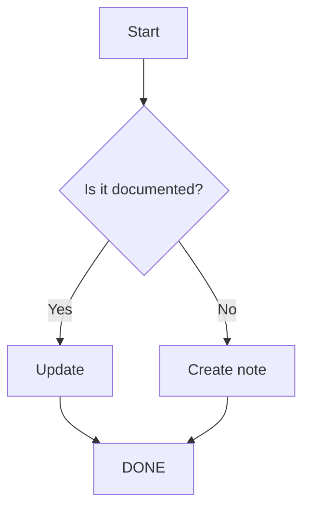
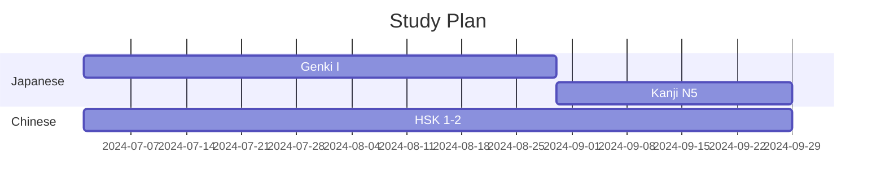

# Инструменты — Микро-детали

## 1. Git workflow — продвинутые сценарии

### 1.1 Работа с ветками

```bash
# Создать ветку для новой темы
git checkout -b feature/add-hindi-language

# Вернуться к main
git checkout main

# Слить ветку
git merge feature/add-hindi-language

# Удалить ветку
git branch -d feature/add-hindi-language
```

### 1.2 Конфликты — разрешение

```bash
# Возник конфликт при merge
git merge feature/new-structure
# CONFLICT in knowledge/index.md

# Посмотреть конфликтующие файлы
git status

# Открыть файл, найти маркеры:
# <<<<<<< HEAD
# текущая версия
# =======
# вливаемое изменение
# >>>>>>> feature/new-structure

# После исправления:
git add knowledge/index.md
git commit
```

### 1.3 Cherry-pick — взять только нужный коммит

```bash
# Взять один коммит из другой ветки
git cherry-pick abc123def

# Взять несколько (не последовательные)
git cherry-pick abc123 def456 ghi789
```

### 1.4 Rebase — перебазирование

```bash
# Перебазировать текущую ветку на main
git rebase main

# Интерактивный rebase — переписать историю
git rebase -i HEAD~5

# Доступные операции:
# pick — оставить
# reword — изменить сообщение
# edit — остановиться для изменений
# squash — объединить с предыдущим
# fixup — объединить, отбросив сообщение
# drop — удалить коммит
```

### 1.5 Git hooks — автоматизация

```bash
# .git/hooks/post-commit
#!/bin/bash
# Автоматический push после commit
git push origin main
```

```bash
# .git/hooks/pre-commit
#!/bin/bash
# Проверка: нет ли в файлах TODO
if grep -r "TODO" knowledge/ --include="*.md"; then
    echo "⚠️  Внимание: найдены TODO в файлах!"
    exit 1
fi
```

---

## 2. VSCode — продвинутые workflow

### 2.1 Snippets для быстрого ввода

```json
// .vscode/knowledge.code-snippets
{
    "Book note": {
        "prefix": "booknote",
        "body": [
            "---",
            "title: \"$1\"",
            "author: \"$2\"",
            "rating: ",
            "status: to-read",
            "---",
            "",
            "## Summary",
            "",
            "## Key Ideas",
            "",
            "## Quotes",
            ""
        ],
        "description": "Book note template"
    },
    "Language word": {
        "prefix": "langword",
        "body": [
            "### $1",
            "",
            "**Язык:** $2",
            "**Слово:** $3",
            "**Чтение:** $4",
            "**Перевод:** $5",
            "**Пример:** $6",
            ""
        ],
        "description": "Language word entry"
    }
}
```

### 2.2 Tasks — автоматические команды

```json
// .vscode/tasks.json
{
    "version": "2.0.0",
    "tasks": [
        {
            "label": "Git: commit & push",
            "type": "shell",
            "command": "git add -A && git commit -m 'update: ${input:message}' && git push",
            "problemMatcher": [],
            "group": "none"
        },
        {
            "label": "Git: status",
            "type": "shell",
            "command": "git status --short",
            "group": "none"
        },
        {
            "label": "Stats: word count",
            "type": "shell",
            "command": "find knowledge -name '*.md' -exec wc -w {} + | tail -1",
            "group": "none"
        }
    ]
}
```

### 2.3 Keybindings

```json
// keybindings.json (Preferences: Open Keyboard Shortcuts)
[
    {
        "key": "ctrl+alt+b",
        "command": "markdown-preview-enhanced.openPreview"
    },
    {
        "key": "ctrl+alt+g",
        "command": "workbench.view.scm"
    },
    {
        "key": "ctrl+shift+f",
        "command": "workbench.action.findInFiles",
        "when": "!searchViewletVisible"
    }
]
```

---

## 3. Markdown — продвинутый синтаксис

### 3.1 Mermaid — диаграммы (Obsidian/GitHub)





### 3.2 LaTeX — математика

```latex
// Inline: $E = mc^2$
// Block:

$$
\int_{a}^{b} f(x) \, dx = F(b) - F(a)
$$

$$
\sum_{n=1}^{\infty} \frac{1}{n^2} = \frac{\pi^2}{6}
$$

$$
\begin{pmatrix}
a & b \\
c & d
\end{pmatrix}
$$
```

### 3.3 Callouts (Obsidian)

```markdown
> [!NOTE] Это заметка
> Полезная информация

> [!WARNING] Внимание
> Это важно!

> [!TIP] Совет
> Так будет лучше

> [!DANGER] Опасно
> Это может вызвать ошибку

> [!EXAMPLE] Пример
> Вот как это работает
```

---

## 4. GitHub Actions — автоматизация базы

### 4.1 Автоматическая проверка ссылок

```yaml
# .github/workflows/check-links.yml
name: Check Links
on:
  schedule:
    - cron: '0 6 * * 1'  # Каждый понедельник
  workflow_dispatch:

jobs:
  check:
    runs-on: ubuntu-latest
    steps:
      - uses: actions/checkout@v4
      - name: Check Markdown links
        uses: gaurav-nelson/github-action-markdown-link-check@v1
        with:
          use-quiet-mode: 'yes'
```

### 4.2 Автоформатирование

```yaml
# .github/workflows/format.yml
name: Format
on:
  push:
    branches: [main]
  
jobs:
  format:
    runs-on: ubuntu-latest
    steps:
      - uses: actions/checkout@v4
      - name: Prettify markdown
        uses: creyD/prettier_action@v4.3
        with:
          prettier_options: '--write **/*.md'
```

### 4.3 Статистика репозитория

```yaml
# .github/workflows/stats.yml
name: Stats
on:
  schedule:
    - cron: '0 0 * * 0'  # Каждое воскресенье
  
jobs:
  stats:
    runs-on: ubuntu-latest
    steps:
      - uses: actions/checkout@v4
      - name: Generate stats
        run: |
          echo "# Статистика базы знаний" > stats.md
          echo "" >> stats.md
          echo "## Количество файлов" >> stats.md
          find knowledge -name "*.md" | wc -l >> stats.md
          echo "## Общий объём (слов)" >> stats.md
          find knowledge -name "*.md" -exec cat {} + | wc -w >> stats.md
          echo "## Распределение по категориям" >> stats.md
          for dir in knowledge/*/; do
            name=$(basename "$dir")
            count=$(find "$dir" -name "*.md" | wc -l)
            words=$(find "$dir" -name "*.md" -exec cat {} + | wc -w)
            echo "- $name: $count файлов, $words слов" >> stats.md
          done
```

---

## 5. Obsidian — продвинутые плагины

### 5.1 Dataview — примеры запросов

```dataview
# Все книги по философии
TABLE author, rating, status
FROM "knowledge"
WHERE contains(file.tags, "philosophy")
SORT rating DESC

# Случайная заметка для повторения
TABLE file.day, file.tags
FROM "knowledge"
SORT random() ASC
LIMIT 1

# Количество заметок по тегам
TABLE length(rows) AS count
FROM "knowledge"
FLATTEN file.tags AS tag
GROUP BY tag
SORT count DESC
```

### 5.2 Templater — сценарии

```javascript
// Вставка даты
<% tp.date.now("YYYY-MM-DD dddd") %>

// Создание заметки по шаблону
<% tp.file.include("templates/book-note") %>

// Запрос пользователя
<% tp.system.prompt("Book title") %>

// Выбор из списка
<% tp.system.suggester(["Read", "Reading", "To Read"], ["read", "reading", "to-read"]) %>

// Вставка содержимого файла
<% tp.file.content("knowledge/index.md") %>
```

### 5.3 Periodic Notes — настройка

```
Ежедневные заметки: knowledge/daily/YYYY/MM/YYYY-MM-DD.md
Еженедельные: knowledge/weekly/YYYY/YYYY-WW.md
Ежемесячные: knowledge/monthly/YYYY-MM.md
```

---

## 6. Автоматизация — скрипты

### 6.1 sync.sh — полный sync

```bash
#!/bin/bash
# sync.sh — push базы знаний

cd "$(dirname "$0")"

# Проверить изменения
if git diff --quiet && git diff --cached --quiet; then
    echo "✅  Нет изменений"
    exit 0
fi

# Показать что изменилось
echo "📝  Изменения:"
git status --short

# Добавить, закоммитить, запушить
git add -A
git commit -m "sync: $(date +%Y-%m-%dT%H:%M:%S)"
git push

echo "✅  Синхронизировано"
```

### 6.2 check-structure.sh — проверка структуры

```bash
#!/bin/bash
# check-structure.sh — проверка целостности

errors=0

# 1. index.md должен быть в каждой папке
for dir in knowledge/*/; do
    if [ ! -f "${dir}/index.md" ]; then
        echo "❌  Нет index.md в $dir"
        errors=$((errors + 1))
    fi
done

# 2. Нет файлов без расширения
for file in knowledge/**/*; do
    if [ ! -d "$file" ] && [ "${file##*.}" != "md" ]; then
        echo "❌  Не .md файл: $file"
        errors=$((errors + 1))
    fi
done

if [ $errors -eq 0 ]; then
    echo "✅  Структура в порядке"
else
    echo "⚠️  $errors ошибок"
fi
```

### 6.3 stats.sh — статистика

```bash
#!/bin/bash

echo "═══════════════════════════════"
echo "  База знаний — Статистика"
echo "═══════════════════════════════"
echo ""

total_files=$(find knowledge -name "*.md" | wc -l)
total_words=$(find knowledge -name "*.md" -exec cat {} + | wc -w)
total_lines=$(find knowledge -name "*.md" -exec cat {} + | wc -l)
last_modified=$(find knowledge -name "*.md" -exec stat -c "%Y" {} + | sort -n | tail -1 | xargs -I{} date -d @{} "+%Y-%m-%d %H:%M")

echo "📁  Файлов:       $total_files"
echo "📝  Слов:         $total_words"
echo "📏  Строк:        $total_lines"
echo "🕐  Последнее изменение: $last_modified"
echo ""

echo "По категориям:"
for dir in knowledge/*/; do
    name=$(basename "$dir")
    files=$(find "$dir" -name "*.md" | wc -l)
    words=$(find "$dir" -name "*.md" -exec cat {} + | wc -w)
    printf "  %-20s %3d файлов, %6d слов\n" "$name" "$files" "$words"
done

echo ""
echo "По подкатегориям:"
for dir in knowledge/*/*/; do
    name=$(basename "$dir")
    parent=$(basename "$(dirname "$dir")")
    files=$(find "$dir" -name "*.md" | wc -l)
    if [ "$files" -gt 0 ]; then
        printf "  %-20s %3d файлов\n" "$parent/$name" "$files"
    fi
done
```

---

## 7. Работа на нескольких устройствах

### 7.1 Obsidian Sync (платный) vs Git

| Критерий | Obsidian Sync | Git |
|----------|--------------|-----|
| Цена | $5/мес | Бесплатно |
| Конфликты | Авто | Ручное разрешение |
| История | 30 дней | Вся история |
| Версионирование | Нет | Да |
| Коллаборация | Нет | Да |
| Шифрование | E2E | SSH/GPG |

### 7.2 Настройка multi-device через Git

```bash
# Компьютер 1 (основной)
git clone git@github.com:madsaomi13/materials.git
# работа...

# Компьютер 2
git clone git@github.com:madsaomi13/materials.git

# Важно: pull перед работой!
# На устройстве 2:
git pull --rebase
# Работа, commit, push

# На устройстве 1:
git pull --rebase
```

### 7.3 Mobile

**iOS:**
- Obsidian Mobile — редактор
- Working Copy — Git клиент
- Shortcuts — автоматизация

**Android:**
- Obsidian Mobile — редактор
- Termux — Git
- MGit — Git GUI

---

## 8. Миграция между платформами

### 8.1 Obsidian → другие

```markdown
# Obsidian to Notion
# Экспорт в Markdown → импорт через Notion API

# Obsidian to Roam Research
# JSON export через плагин

# Obsidian to Logseq
# Просто открыть ту же папку (Logseq читает Markdown)
```

### 8.2 Формат — почему Markdown

- Самый портативный формат
- Читается любым редактором
- Git-friendly (diff, merge)
- Obsidian, Logseq, Notion, Roam — все импортят .md

---

*Микро-детали по инструментам. Дополняется.*
